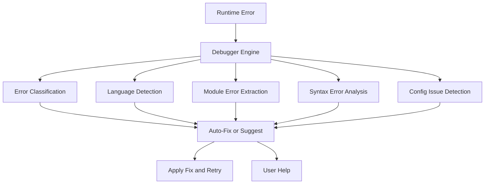

# ⚡ Runit

**AI-powered execution agent — makes any GitHub repo runnable with one command.**

No manual setup. No dependency hunting. No config files. **Just run.**

[]()
[]()
[]()
[]()
[]()
[]()
[]()

---

## Table of Contents

- [Quick Start](#quick-start)
- [About](#about)
- [What is Runit?](#what-is-runit)
- [Features](#features)
- [Installation](#installation)
- [Usage](#usage)
- [Agent Skills](#agent-skills)
- [Advanced Debugger](#advanced-debugger)
- [How It Works](#how-it-works)
- [Bring Your Own Key](#bring-your-own-key-byok)
- [How-To Guides](#how-to-guides)
- [Configuration](#configuration)
- [Architecture](#architecture)
- [Contributing](#contributing)
- [License](#license)

---

## Quick Start

```bash
# Run any GitHub repo — one command
runit https://github.com/jaypaun007/repo

# Run your local project
runit .

# First-time setup (optional, for AI-powered analysis)
runit --setup
```

> One command. Zero config. Any repo. Any language.

---

## About

**Runit** is an open-source CLI tool by [Jay Paun](https://github.com/jaypaun007) that eliminates the friction of running unfamiliar code. Instead of reading docs, installing toolchains, hunting for entry points, and debugging setup scripts — you give Runit a URL and it does the rest.

It combines **AI-powered project analysis** with **17 language-specific execution skills** to clone, analyze, install, run, and debug any GitHub repository automatically. Whether you are evaluating a library, spinning up a hackathon project, or testing a PR — Runit turns `git clone && cd && read && configure && install && build && run` into a single command.

Runit was built to solve a simple problem: **most open-source projects never get run because the setup is too painful.** By automating the entire setup-to-execution pipeline, Runit makes code exploration as easy as visiting a website.

- **License:** MIT
- **Author:** [Jay Paun](https://github.com/jaypaun007)
- **Repository:** [github.com/jaypaun007/runit](https://github.com/jaypaun007/runit)
- **Latest release:** [v1.1.0](https://github.com/jaypaun007/runit/releases)

---

## What is Runit?

Runit is an **AI-powered execution agent** that automatically figures out how to run any project from a GitHub URL or local folder. It analyzes the codebase, detects the language and framework, installs dependencies, and executes the project — handling errors and retrying with smarter strategies until it works.

Think of it as **`pip install` for entire repositories**. No more reading READMEs, hunting for dependency instructions, or debugging setup scripts. Just point Runit at a repo and it handles everything.

### Who is it for?

- **Developers** trying to quickly evaluate a new library or tool
- **Hackathon participants** spinning up unfamiliar projects
- **Open source maintainers** testing contributions
- **Students** learning from GitHub repos
- **Anyone** tired of manual project setup

---

## Features

| Feature | Description |
|---------|-------------|
| One-command execution | `runit https://github.com/jaypaun007/repo` — done |
| AI-powered analysis | Understands project structure, finds entry points |
| Smart dependency install | Installs only what's needed per project type |
| Auto error recovery | Detects failures, fixes them, retries |
| Advanced Debugger | Error classification, language detection, code patches |
| 17 Agent Skills | Python, Node, Rust, Go, Ruby, Deno, Java, C/C++, C#, PHP, Kotlin, Dart, R, Julia, Lua, Scala, Elixir |
| BYOK (Bring Your Own Key) | OpenAI, Anthropic, or any custom endpoint |
| User instructions | Tell Runit how to run your project |
| Web research | Searches online for error solutions |
| Private repos | Authenticate with token or env var |
| Key management | Store API keys securely |
| Beautiful CLI | Rich colored output |
| Cloud-native | macOS, Linux, Windows, Kaggle, Google Colab |

---

## Installation

### macOS / Linux

```bash
# One-liner
git clone https://github.com/jaypaun007/runit.git
cd runit
chmod +x install.sh && ./install.sh

# Or via pip
pip install git+https://github.com/jaypaun007/runit.git
```

### Windows (PowerShell)

```powershell
# One-liner
git clone https://github.com/jaypaun007/runit.git
cd runit
.\install.ps1

# Or via pip
pip install git+https://github.com/jaypaun007/runit.git
```

### Kaggle / Google Colab

```python
!pip install git+https://github.com/jaypaun007/runit.git
!runit https://github.com/jaypaun007/repo --yes --plain
```

---

## Usage

### Basic Commands

```bash
# Run a GitHub repository
runit https://github.com/jaypaun007/repo

# Run a local project
runit /path/to/project
runit .

# Run a private repo
runit https://github.com/your-org/private-repo --token ghp_xxxxxxxxxxxx
```

### Management Commands

```bash
# Interactive setup wizard (AI provider)
runit --setup

# View config and status
runit --status

# List all agent skills
runit --skills

# Manage stored keys
runit --key-list
runit --key-add MY_API_KEY
runit --key-delete MY_API_KEY
```

### Options

| Flag | Description |
|------|-------------|
| `--retries N` | Max retry attempts (default: 3) |
| `--token, -t` | GitHub personal access token |
| `--docker` | Force Docker mode |
| `--dev` | Force development mode |
| `--yes, -y` | Auto-confirm all prompts (for Colab/Kaggle) |
| `--plain` | Disable colored output (auto-enabled in notebooks) |
| `--version` | Show version |

---

## Agent Skills

Runit ships with **17 specialized agent skills** covering all major programming languages. Each skill knows how to detect, install dependencies, and run its project type.

### Core Skills

| Skill | Detects | Installs | Runs |
|-------|---------|----------|------|
| Python | `requirements.txt`, `setup.py`, `pyproject.toml` | `pip install` | `python <entry>` |
| Node.js | `package.json`, `yarn.lock`, `pnpm-lock.yaml` | `npm/pnpm/yarn install` | `node <entry>` |
| Rust | `Cargo.toml` | `cargo build` | `cargo run` |
| Go | `go.mod`, `go.sum` | `go mod download` | `go run .` |
| Ruby | `Gemfile`, `Gemfile.lock` | `bundle install` | `ruby <entry>` |
| Deno | `deno.json`, `deno.jsonc` | — | `deno run` |
| Java | `pom.xml`, `build.gradle` | — | `mvn compile` |

### Extended Skills (v1.1)

| Skill | Detects | Installs | Runs |
|-------|---------|----------|------|
| C/C++ | `CMakeLists.txt`, `Makefile`, `configure` | `cmake / make` | `make / cmake && make` |
| C#/.NET | `*.csproj`, `*.sln` | `dotnet restore` | `dotnet run` |
| PHP | `composer.json`, `artisan` | `composer install` | `php -S localhost:8000` |
| Kotlin | `*.kt`, `build.gradle.kts` | `gradle build` | `gradle run / kotlinc` |
| Dart/Flutter | `pubspec.yaml` | `dart pub get` | `dart run / flutter run` |
| R | `DESCRIPTION`, `*.Rproj` | `renv::restore()` | `Rscript <entry>` |
| Julia | `Project.toml` | `Pkg.instantiate()` | `julia <entry>` |
| Lua | `*.rockspec`, `*.lua` | `luarocks install` | `lua <entry>` |
| Scala | `build.sbt`, `*.scala` | `sbt update` | `sbt run` |
| Elixir | `mix.exs` | `mix deps.get` | `mix run` |

```bash
# View all available skills
runit --skills
```

---

## Advanced Debugger

Built-in debugger that analyzes runtime errors using multiple strategies:



### Error Types Detected

- **Missing API Keys** — detects auth/credential errors
- **Port Conflicts** — finds `EADDRINUSE`, port binding issues
- **Missing Modules** — across all 17 languages
- **Network Errors** — `ECONNREFUSED`, timeouts, DNS failures
- **Permission Errors** — `EACCES`, `EPERM`, `Permission denied`
- **Disk/Memory** — `ENOSPC`, `OutOfMemoryError`, heap issues
- **Version Mismatches** — incompatible dependency versions
- **Config Errors** — missing `.env`, invalid settings

The debugger displays a structured report on every error before attempting fixes.

---

## How It Works

```
  User input (repo URL / folder path)
          |
          v
  +-------------------------------+
  | 1. Project Loader             |  Clone repo or scan folder
  |    - GitHub token support     |  Private repo auth
  +---------------+---------------+ 
                  |
                  v
  +-------------------------------+
  | 2. AI Analysis                |  LLM understands project structure
  |    - File tree scanning       |  Finds entry points, deps, env vars
  |    - README fetching          |  Better context without cloning
  +---------------+---------------+ 
                  |
                  v
  +-------------------------------+
  | 3. Skill Match                |  Load specialized agent skill
  |    - 17 language skills       |  Type-specific install and run logic
  +---------------+---------------+ 
                  |
                  v
  +-------------------------------+
  | 4. Install Dependencies       |  Only what's needed
  |    - pip / npm / cargo ...    |  Per-language package manager
  +---------------+---------------+ 
                  |
                  v
  +-------------------------------+
  | 5. Execute                    |  Run the project
  +-------------------------------+
                  |
         +--------+--------+
         |                  |
         v                  v
   Success               Error ---> +-----------------------+
                                    | 6. Debugger Engine    |
                                    |   - Error classify    |
                                    |   - Language detect   |
                                    |   - Module extract    |
                                    |   - Config check      |
                                    |   - Web research      |
                                    +-----------+-----------+
                                                |
                                    +-----------v-----------+
                                    | Escalation Chain       |
                                    | 1. Auto-fix            |
                                    | 2. Ask for keys        |
                                    | 3. .env setup          |
                                    | 4. Web search          |
                                    | 5. User help           |
                                    +-----------+-----------+
                                                |
                                                v
                                    +-----------------------+
                                    | Retry (loop)          |
                                    | until success         |
                                    | or user quits         |
                                    +-----------------------+
```

### AI Usage Boundaries

| AI is used for | AI is NOT used for |
|----------------|-------------------|
| Understanding project structure | Running code |
| Deciding entry point | Replacing dependency manager |
| Fixing runtime errors | System-level installation |
| Generating execution plan | Modifying user code |

---

## Bring Your Own Key (BYOK)

Runit uses AI only for **analysis** and **error fixing** — not for running your code. You bring your own API key.

### Supported Providers

| Provider | Default Model | Custom Endpoint |
|----------|---------------|-----------------|
| OpenAI | `gpt-4` | Any OpenAI-compatible API |
| Anthropic | `claude-3-5-sonnet` | Any Anthropic-compatible API |
| Custom | user-defined | Any endpoint |

### Setup

```bash
# Interactive wizard
runit --setup

# Or via environment variables
export RUNIT_API_KEY="sk-..."
export RUNIT_PROVIDER="openai"
export RUNIT_MODEL="gpt-4"
export RUNIT_BASE_URL="https://api.openai.com/v1"
```

### Local LLMs (Ollama, LocalAI, vLLM)

```bash
export RUNIT_BASE_URL="http://localhost:11434/v1"
export RUNIT_API_KEY="ollama"
export RUNIT_MODEL="llama3"
export RUNIT_PROVIDER="custom"
runit .
```

> No API key? Runit still works with limited fallback analysis — it just won't use AI for project understanding.

---

## How-To Guides

### Run any GitHub repo

```bash
runit https://github.com/jaypaun007/repo
runit https://github.com/jaypaun007/repo --retries 5
runit https://github.com/jaypaun007/repo --yes --plain
```

### Provide custom instructions

```
$ runit .
  ...
  [2/6] Optional: Add custom instructions
  Any special instructions for how to run this project?
     (e.g. 'use python3 instead of python', 'set --port 9000')
     Press Enter to skip
  Instructions: use python3.11 instead of python3
  Noted
```

### Handle missing API keys

```
  This project requires 2 environment variable(s)
    OPENAI_API_KEY
    DATABASE_URL
  Set these now? [Y/n]: y
  Enter value for OPENAI_API_KEY:
  OPENAI_API_KEY set
```

Keys are stored securely in `~/.runit/keys.json` for reuse.

### Docker mode

```bash
# Auto-detect
runit https://github.com/jaypaun007/repo

# Force mode
runit https://github.com/jaypaun007/repo --docker
runit https://github.com/jaypaun007/repo --dev
```

Auto-detects exposed ports from `Dockerfile`, port mappings from `docker-compose.yml`, and Docker images from README.

### Run a private repository

```bash
# Via CLI flag
runit https://github.com/org/private-repo --token ghp_xxx

# Via environment variable
export GITHUB_TOKEN=ghp_xxx
runit https://github.com/org/private-repo
```

---

## Configuration

Config file: `~/.runit/config.json`

```json
{
  "provider": "openai",
  "model": "gpt-4",
  "api_key": "sk-...",
  "base_url": "https://api.openai.com/v1",
  "max_retries": 3,
  "notifications": true
}
```

Configure via:
- `runit --setup` — interactive wizard
- Environment variables — `RUNIT_API_KEY`, `RUNIT_PROVIDER`, `RUNIT_MODEL`, `RUNIT_BASE_URL`
- Direct file edit — `~/.runit/config.json`

---

## Architecture

```
runit/
├── runit/
│   ├── __init__.py         # Package metadata (v1.1.0)
│   ├── main.py             # CLI orchestration and entry point
│   ├── cli.py              # Terminal UI (rich + fallback)
│   ├── config.py           # Configuration and key management
│   ├── byok.py             # BYOK setup wizard
│   ├── llm.py              # AI client (OpenAI, Anthropic, custom)
│   ├── environment.py      # Kaggle/Colab detection, platform info
│   ├── web_tools.py        # Web search, GitHub API, error research
│   ├── project_loader.py   # Clone repos, scan folders
│   ├── analyzer.py         # AI analysis + env var scanning
│   ├── skills.py           # Agent skill registry (17 languages)
│   ├── deps.py             # Smart dependency installer
│   ├── executor.py         # Execution engine (env-aware)
│   ├── error_handler.py    # Error detection, auto-fix
│   ├── debugger.py         # Advanced debugger + code fixes
│   └── notify.py           # Desktop notifications
├── tests/                  # 65+ tests
├── assets/                 # Images, banners
├── setup.py                # Package installer
├── requirements.txt        # Python dependencies
├── install.sh              # macOS/Linux installer
├── install.ps1             # Windows installer
├── LICENSE                 # MIT
└── README.md               # This file
```

---

## Contributing

**Contributions are welcome and appreciated!**

```bash
# Fork, then:
git clone https://github.com/your-username/runit.git
cd runit
pip install -e ".[dev]"
python -m pytest tests/
```

### Ways to contribute

- **Report bugs** — Open an [issue](https://github.com/jaypaun007/runit/issues)
- **Suggest features** — Start a [discussion](https://github.com/jaypaun007/runit/discussions)
- **Submit PRs** — Fix bugs, add skills, improve the debugger
- **Improve docs** — Better examples, clearer guides
- **Add a skill** — Support a new language
- **Write tests** — Help reach higher coverage

### Roadmap

- [x] Core engine — 7 base languages
- [x] 10 new language skills
- [x] Advanced debugger
- [x] Docker mode with port detection
- [x] Web research and error search
- [x] BYOK — any AI provider
- [ ] GitHub Actions CI/CD
- [ ] PyPI publishing
- [ ] VS Code extension
- [ ] Web UI dashboard
- [ ] Windows native installer

---

## Safety

| Rule | Description |
|------|-------------|
| Never deletes code | Only installs dependencies |
| Never runs destructive commands | Safe execution only |
| Asks before modifying files | User always in control |
| Educational use only | See disclaimer |

---

## Disclaimer

Runit is provided for **educational and research purposes only**. By using this tool, you acknowledge:

- Running arbitrary code from unknown sources carries inherent security risks
- You are responsible for reviewing any code before executing it
- The authors assume **no liability** for any damage or security breaches
- Use isolated environments (containers, VMs) when evaluating untrusted code
- You assume **all risk** associated with executing third-party projects

---

## License

MIT — see [LICENSE](LICENSE) for details.

---

*Made with by [Jay Paun](https://github.com/jaypaun007)*

[Home](https://github.com/jaypaun007/runit) |
[Report Bug](https://github.com/jaypaun007/runit/issues) |
[Feature Request](https://github.com/jaypaun007/runit/discussions) |
[Submit PR](https://github.com/jaypaun007/runit/pulls) |
[Star](https://github.com/jaypaun007/runit/stargazers)

*Built with Python. Powered by AI. Driven by community.*
